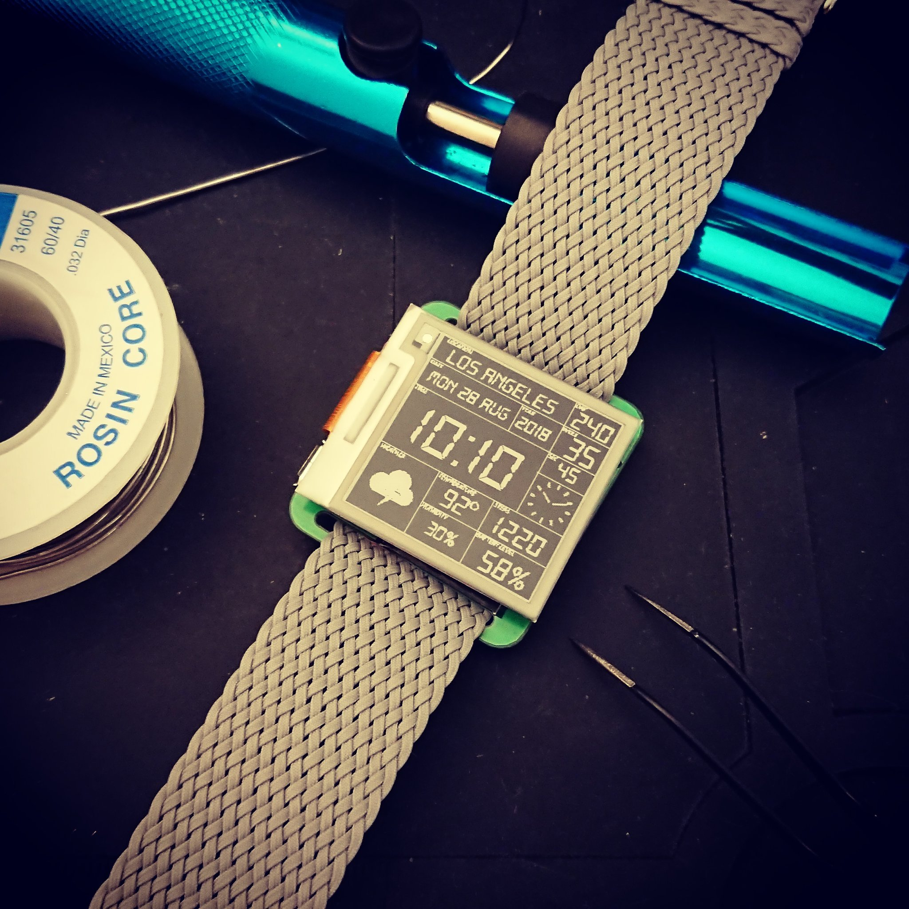

# Watchy



1. In the Arduino IDE Boards Manager, install support for the ESP32. You can find instructions here: https://github.com/espressif/arduino-esp32/blob/master/docs/arduino-ide/boards_manager.md
2. Install the following libraries:
    * [DS3232RTC](https://github.com/JChristensen/DS3232RTC)
    * [GxEPD](https://github.com/ZinggJM/GxEPD)
    * [Watchy](https://github.com/sqfmi/Watchy) (This library)
3. Check out the examples under ```Examples``` -> ```Watchy```
4. Compile & Upload with these board settings:
    * Board: "ESP32 Wrover Module"
    * All Other Settings: leave to default
    * You may have to install the [CP2104 USB to Serial drivers](https://www.silabs.com/products/development-tools/software/usb-to-uart-bridge-vcp-drivers) if the port is not automatically detected
    * Have Fun! :)
    
    
Looking for Watchy hardware details? Go here https://github.com/sqfmi/Watchy-Hardware    
